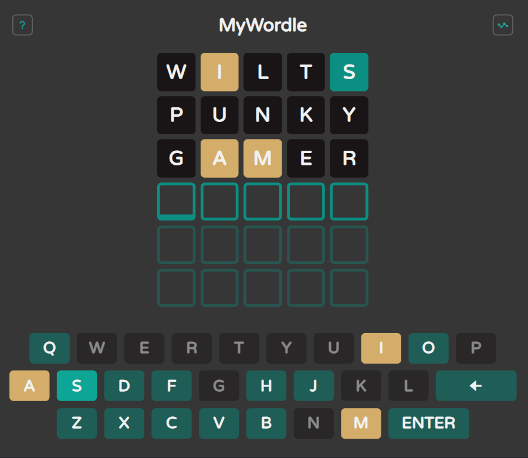

## MyWordle 

É um jogo inspirado pelos jogos [Termo](https://term.ooo/) e [Wordle](https://www.nytimes.com/games/wordle/index.html), porém com algumas modificações. Nele, o objetivo é adivinhar uma palavra de 5 letras, em inglês, dando palpites com outras palavras, com 6 tentativas ao máximo. 

A cada palavra inserida, as letras recebem uma cor. Quando uma letra pertence à palavra correta e está na mesma posição, recebe a cor verde, se pertence à palavra, mas não está na posição, recebe a cor amarela e se não pertence, recebe a cor preta. Além disso, apenas palavras válidas são aceitas, verificadas em um banco de palavras. A palavra objetivo também é sorteada de um banco de opções. 

A cada acesso é possível jogar uma nova palavra, e não apenas uma por dia, como nos jogos originais, ou seja, pode-se jogar várias vezes seguidas. Além disso, após descobrir a palavra, é possível acessar um link para ver diretamente a tradução do termo em inglês, utilizando o [Google Translate](https://translate.google.com.br/?hl=pt-BR). Assim, a cada nova palavra descoberta é possível ver suas possíveis traduções.



### Tecnologias 
<div style="display: flex; gap: 5px;">
    
    
    
</div>

### Execução
Para executar o projeto basta clonar o repositório com o link abaixo:
```bash
git clone https://github.com/gabriel-piva/myWordle.git
```
Depois, navegue até a pasta e abra o arquivo `index.html` em algum servidor web.

Também é possível acessar o jogo com o link [🔗MyWordle](https://gabriel-piva.github.io/myWordle/) gerado com o [Github Pages](https://pages.github.com/).

### Referências
O ícone da página vem do [Icon-Icons](https://icon-icons.com/pt/icone/palavra-mac/23563), a biblioteca de ícones é a [Boxicons](https://boxicons.com/) e a fonte vem do [Google Fonts](https://fonts.google.com/specimen/Varela+Round). O banco de palavras aceitas e as palavras que podem ser sorteadas vem do canal [Web Dev Simplified](https://github.com/WebDevSimplified/wordle-clone).